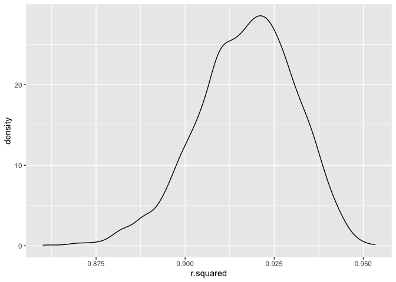
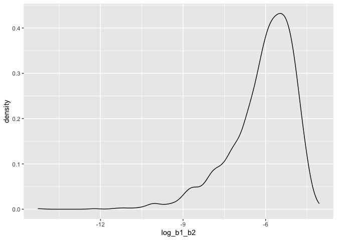

p8105_hw6_eih2108
================
Ekaterina Hofrenning
2023-11-27

# Problem 2

The boostrap is helpful when you’d like to perform inference for a
parameter / value / summary that doesn’t have an easy-to-write-down
distribution in the usual repeated sampling framework. We’ll focus on a
simple linear regression with tmax as the response with tmin and prcp as
the predictors, and are interested in the distribution of two quantities
estimated from these data:

- r^ 2
- log(b1\*b2)

Use 5000 bootstrap samples and, for each bootstrap sample, produce
estimates of these two quantities. Plot the distribution of your
estimates, and describe these in words. Using the 5000 bootstrap
estimates, identify the 2.5% and 97.5% quantiles to provide a 95%
confidence interval for r^2 and log(b1\*b2).

``` r
# read data
weather_df = 
  rnoaa::meteo_pull_monitors(
    c("USW00094728"),
    var = c("PRCP", "TMIN", "TMAX"), 
    date_min = "2022-01-01",
    date_max = "2022-12-31") %>%
  mutate(
    name = recode(id, USW00094728 = "CentralPark_NY"),
    tmin = tmin / 10,
    tmax = tmax / 10) %>%
  select(name, id, everything())
```

    ## using cached file: /Users/ekaterinahofrenning/Library/Caches/org.R-project.R/R/rnoaa/noaa_ghcnd/USW00094728.dly

    ## date created (size, mb): 2023-11-27 16:19:07.658772 (8.544)

    ## file min/max dates: 1869-01-01 / 2023-11-30

``` r
# run the bootstraps
bootstrap_df =
  weather_df %>%
  modelr::bootstrap(n = 5000) %>%
  mutate(
    models = map(strap, \(df) lm(tmax ~ tmin + prcp, data = df)),
    results = map(models, broom::tidy),
    rsquared = map(models, broom::glance)) %>%
  select(results, rsquared) %>% unnest(rsquared) %>%
  select(results, r.squared) %>% unnest(results) %>%
  select(term, estimate, r.squared) 
```

``` r
# R^2 plot
bootstrap_df %>%
  filter(term == "(Intercept)") %>%
  ggplot(aes(x = r.squared)) +
  geom_density()
```

<!-- -->

``` r
# CI for R^2
r2_CI <-
  bootstrap_df %>%
  filter(term == "(Intercept)") %>%
  select(r.squared) %>%
  summarize(ci_lower = quantile(r.squared, 0.025), 
            ci_upper = quantile(r.squared, 0.975))

r2_CI
```

    ## # A tibble: 1 × 2
    ##   ci_lower ci_upper
    ##      <dbl>    <dbl>
    ## 1    0.888    0.941

The distribution of the 5000 R-squared values has a slight left skew and
is centered near .92. The 95% confidence interval of the R-squared
values is between: 0.8876077 and 0.9410014.

``` r
# plot log(b1*b2)
bootstrap_df %>%
  pivot_wider(names_from = term, values_from = estimate) %>% 
  rename(beta_1 = tmin, 
         beta_2 = prcp) %>% 
  mutate(log_b1_b2 = log(beta_1 * beta_2)) %>% 
  ggplot(aes(x = log_b1_b2)) + 
  geom_density()
```

<!-- -->

``` r
# CI for log(b1*b2)
log_b1b2_CI <-
bootstrap_df %>%
  pivot_wider(names_from = term, values_from = estimate) %>% 
  rename(beta_1 = tmin, 
         beta_2 = prcp) %>% 
  mutate(log_b1_b2 = log(beta_1 * beta_2)) %>%
  summarize(NA_num = sum(is.na(log_b1_b2)),
            ci_lower = quantile(log_b1_b2, 0.025, na.rm = T), 
            ci_upper = quantile(log_b1_b2, 0.975, na.rm = T))

log_b1b2_CI
```

    ## # A tibble: 1 × 3
    ##   NA_num ci_lower ci_upper
    ##    <int>    <dbl>    <dbl>
    ## 1   3389    -9.05    -4.63

The distribution of the 5000 **log(b1*b2)** values has a large left
skew. It’s peak is around -5. When we take the log of negative values,
NAs are produced. In this case, 3389 NAs were produced. Of those that
are non-NA, the confidence interval for **log(b1*b2)** is between:
-9.0485823 and -4.6329551.
